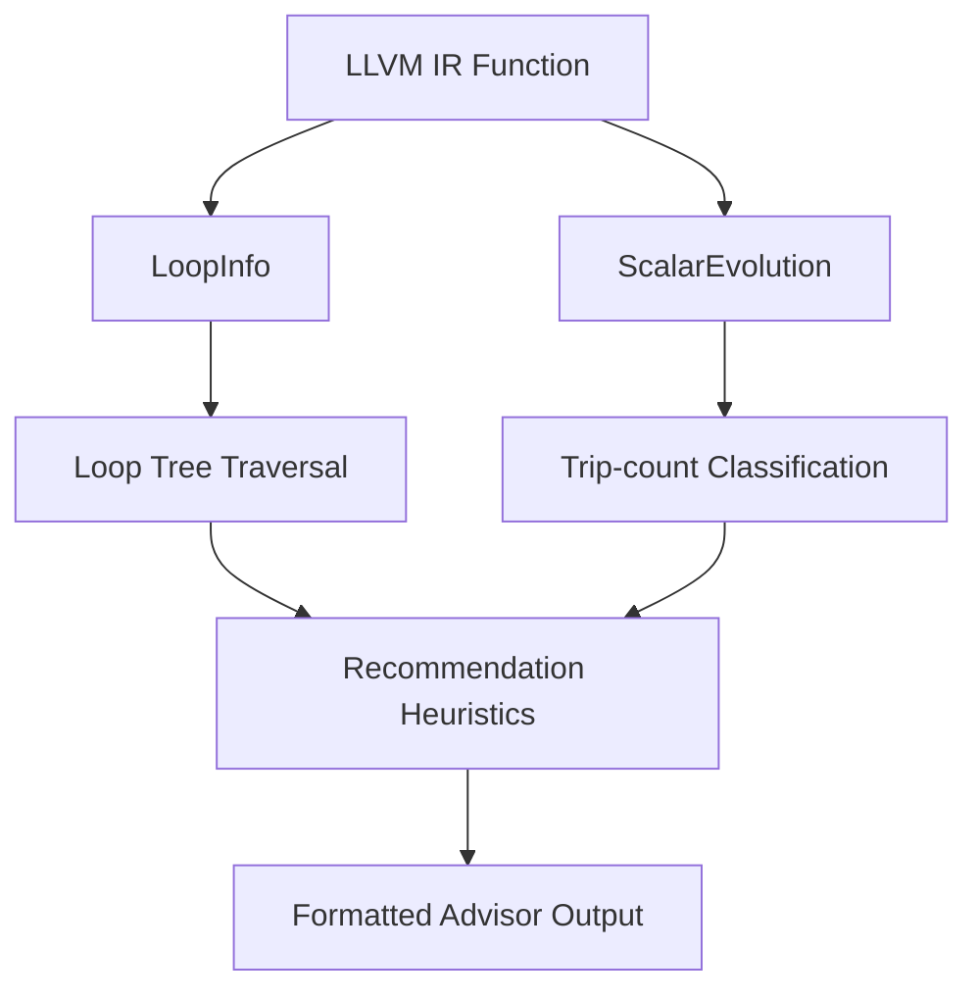

# Design

This document explains the design decisions behind the Loop Unroll Advisor,
with emphasis on engineering tradeoffs and production-style constraints.

## High-level architecture

## Analysis pipeline

1. Enumerate loops using LoopInfo.
2. Classify trip counts using ScalarEvolution.
3. Detect calls in loop bodies.
4. Apply recommendation heuristics based on classification and nesting depth.
5. Emit a structured report for each function.

## Why LoopInfo

- It provides canonical loop nesting and header information.
- It is lightweight and stable across LLVM versions.
- It enables explicit outer/inner loop differentiation.

## Why ScalarEvolution

- It is LLVM's canonical analysis for induction variables and trip counts.
- It provides both exact constants and safe upper bounds.
- It integrates cleanly with LoopInfo in the New Pass Manager.

## Trip-count classification design

- Exact: compile-time constant from getSmallConstantTripCount.
- Bounded: symbolic trip count with a safe upper bound.
- Unknown: SE cannot compute the backedge count.

## Recommendation heuristic rationale

- Full unroll for tiny constant trip counts minimizes branch overhead.
- x4 unroll for moderate counts balances ILP with code-size growth.
- No unroll for large, unknown, or call-heavy loops to avoid bloat.

## Conservative vs aggressive unrolling

- Conservative defaults protect code size and instruction cache behavior.
- Aggressive unrolling is reserved for small constant loops only.

## Call-detection heuristic

- Any non-intrinsic call in the loop body blocks unrolling.
- This matches practical compiler behavior where calls hinder scheduling.

## Nested-loop handling strategy

- Inner loops are evaluated with the same thresholds but flagged as nested.
- Nested loops use cautious unroll factors to avoid multiplicative growth.

## Alternative approaches considered

- Full LoopUnrollPass integration was rejected to keep output advisory only.
- Profile-guided unrolling was excluded for reproducibility and simplicity.
- Cost-model integration was deferred to keep the tool deterministic.

## Design tradeoffs

- The pass is intentionally analysis-only and avoids mutation.
- Debug info is preferred for location fidelity, but IR names are a fallback.

## Scalability considerations

- Loop traversal is linear in number of loops.
- ScalarEvolution queries are cached per function by the analysis manager.
