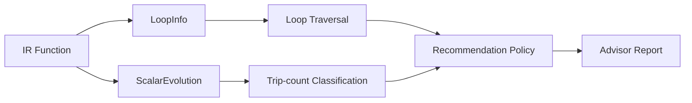

# Architecture summary

The advisor is an analysis-only LLVM plugin that consumes LoopInfo and
ScalarEvolution and produces deterministic recommendations for unrolling.

Key properties:

- No IR mutation; safe to run at any optimization stage.
- Deterministic output independent of profile data.
- Stable, minimal API surface for long-term maintenance.
